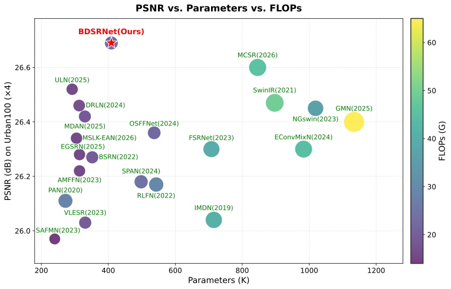
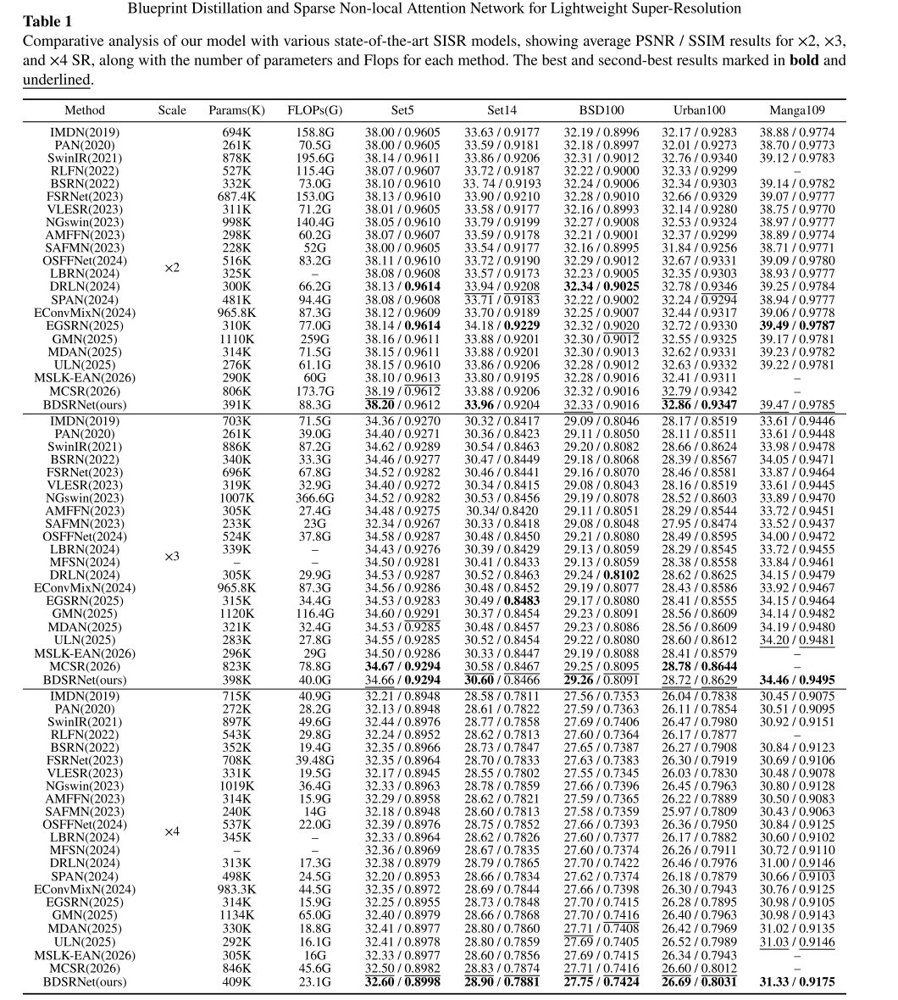
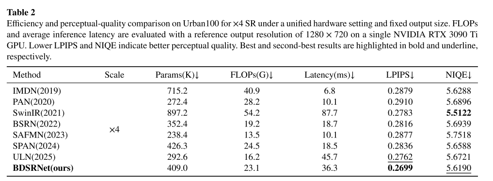
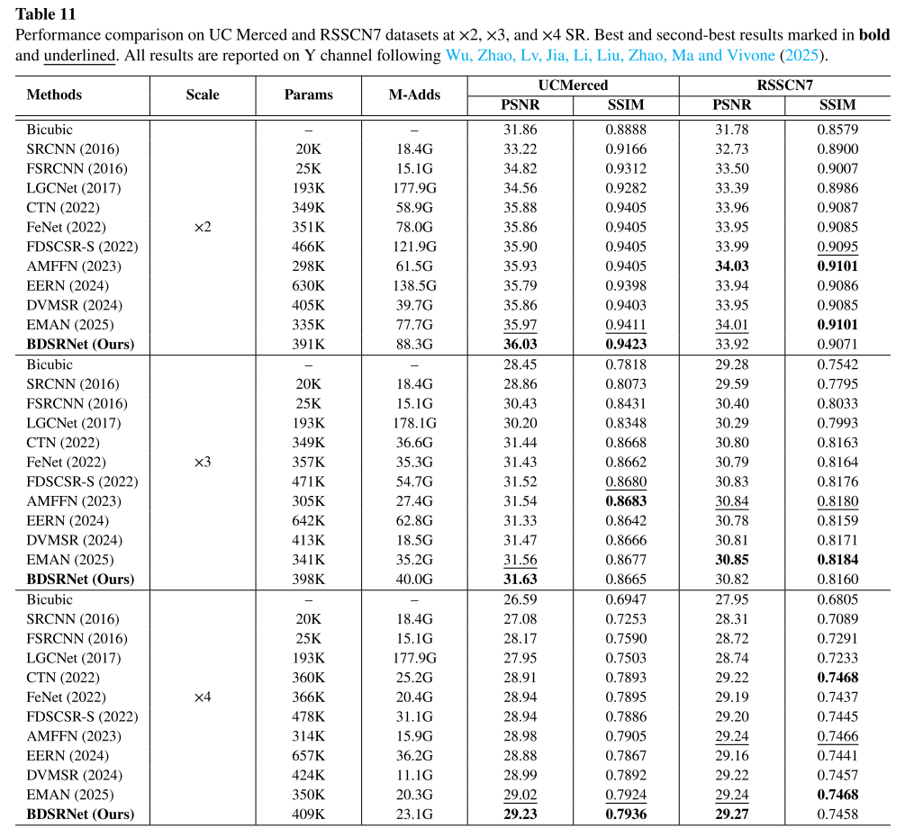
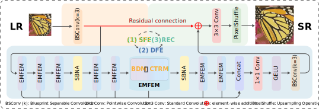

# Anonymous Review Materials for BDSRNet

This anonymous repository provides supplementary review materials for the submission:
**"BDSRNet for Lightweight Image Super-Resolution"**

  
    
  <b>Accuracy–Efficiency Trade-off: A visualization of the performance–parameter–FLOPs trade-off on Urban100 (×4).</b>

---

## Notice on Anonymity and Code Availability
To comply with the double-blind review policy, all supplementary materials in this repository—including experimental logs, evaluation scripts, and visual materials—have been strictly anonymized. 

Please note that the core training and inference source codes are temporarily omitted during the review stage. This repository is intended to support the inspection of the reported results by providing:
- quantitative result summaries,
- network architecture and visual comparisons,
- anonymized training and testing logs, and
- the unified profiling script used for efficiency evaluation.

**The complete executable codebase, pre-trained weights, and the full sets of reconstructed high-resolution images will be made publicly available upon acceptance of the manuscript.**

---

## 1. Quantitative Results and Efficiency Analysis
This section provides the detailed data tables corresponding to the quantitative evaluation in the manuscript.

  <b>Table 1: Benchmark results (PSNR / SSIM) on five standard super-resolution datasets.</b>
    
  

  

  <b>Table 2: Computational efficiency and perceptual-quality comparisons (LPIPS and NIQE) on Urban100 (×4). All models are evaluated under a strictly unified hardware setting and a fixed output size (1280×720) to ensure fair comparison.</b>
    
  

  

  <b>Table 3: Results demonstrating the zero-shot cross-domain performance on UCM and RSSCN7 remote-sensing datasets.</b>
    
  

---

## 2. Visual Materials
This section provides visual materials corresponding to the network design and reconstruction performance.

### Overall Architecture

  
    
  <b>The overall framework diagram of BDSRNet.</b>

### Visual Comparisons
Reconstructed image comparisons against baseline methods are provided below:

  
    
  <b>Visual comparison of reconstructed structured patterns and architectural lines on the Urban100 dataset.</b>

  

  
    
  <b>Visual comparison of reconstructed sharp edges and fine line details on the Manga109 dataset.</b>

---

## 3. Anonymized Experimental Logs
To support the inspection of the reported training and testing results, this repository includes anonymized raw logs exported from our experimental runs.

### Training Logs
The directory `Training_Logs/` contains anonymized logs for the $\times 2$, $\times 3$, and $\times 4$ models, which record:
- iteration records,
- training loss (`L1Loss`) values, and
- validation PSNR tracking.

*(Note: To protect the core architectural innovations during the review stage, the detailed network topology prints—such as specific convolutions and attention layers—have been redacted from the log headers. All training metrics and iteration histories remain intact and completely authentic.)*

### Testing Logs
The directory `Testing_Logs/` contains the anonymized raw output logs parsing the evaluation on:
- five standard benchmark datasets, and
- two remote-sensing datasets for zero-shot evaluation.

---

## 4. Evaluation Script for Efficiency Measurement
The script:
- `unified_benchmark_params_flops_latency.py`

is included to document the exact unified protocol used for the hardware efficiency evaluation in the manuscript, ensuring a fair and reproducible benchmark.

This script details the profiling setup for:
- parameter counting,
- FLOPs estimation (based on a fixed 1280×720 reference output resolution), and
- GPU latency measurement.

Latency measurement follows a fixed protocol with explicit warm-up iterations and synchronized timing to prevent benchmarking biases.

---

### Acknowledgment
**We sincerely thank the Editor and Anonymous Reviewers for their valuable time and effort in evaluating this manuscript.**
